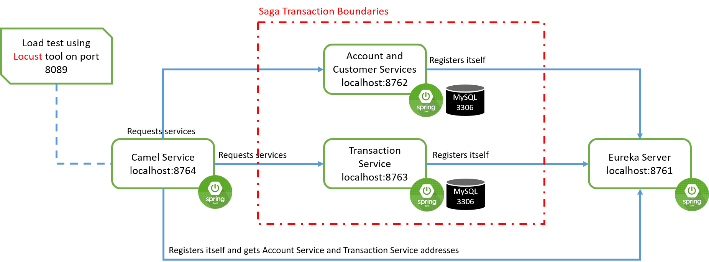

# Spring Boot + Spring Data + Apache Camel (Service Composition Example)

This is a simple example to show you how to implement a `Saga EIP` over simple 
services using `Apache Camel` and `Spring Cloud`

# Libraries and Tools
* [Module] [`Spring Boot`](https://spring.io/projects/spring-boot)
* [Module] [`Spring Cloud`](https://spring.io/projects/spring-cloud)
* [Module] `Spring Data`
* [Library] [`Apache Camel`](https://camel.apache.org/)
* [ORM] `Hibernate` under abstraction of `Spring Data JPA`
* [Database] `MySQL on port 3306`
* [Tool] [`Locust`](https://locust.io/): Tool for load test


# How it works

Bellow is the relationship between different services provided in the example.




This is a common and simple banking business flow. There is a simple `Customer` and `Account` service. Each customer is 
connected to some accounts. Besides for each account, there is some number of transactions over it which is provided and
handled by `Transaction` service. 
There is also a `Camel` service which tries to implement `Saga EIP` over `Account` and `Transaction` services.
All these services are registered in `Eureka` as the service registry and discovery framework.


# How to run
* Start `eureka-service` module. It can be verified using url [http://localhost:8761/](http://localhost:8761/).
* Start `account-service` module. It can be verified using url [http://localhost:8762/accounts](http://localhost:8762/accounts).
* Start `transaction-service` module. It can be verified using url [http://localhost:8763/transactions](http://localhost:8763/transactions).
* Start `camel-service` module. It can be verified using url [http://localhost:8764/health](http://localhost:8764/health).

# Load Test
You should have `Python` and `Locust` installed on your system to do the load test part. To do the load test
simply run the following through the terminal in project root path:
```
cd \path\to\project\spring-boot-cloud-camel-composite-service 
\path\to\locust\locust.exe -f load-test\locustfile.py
```

This starts the locust on  [http://localhost:8089](http://localhost:8089/)
You can set number of users and catch size and then start the test
It sends a lot of `Http.POST` requests to `http://localhost:8764/make-transactions`
