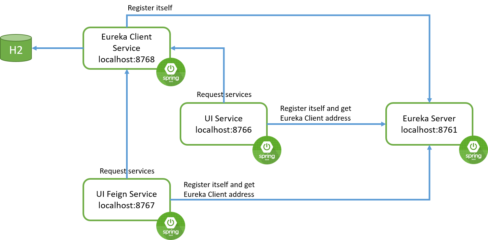

# Spring Boot + Spring Cloud

This is a simple example to show you how Spring Cloud works with Spring Boot.

# Libraries and Tools
* [Module] [`Spring Boot`](https://spring.io/projects/spring-boot)
* [Module] [`Spring Cloud`](https://spring.io/projects/spring-cloud)
* [Module] `Spring Web`
* [Module] `Eureka Server/Client`
* [Library for auto-generating getters, setters, constructors and others] [`Lombok`](https://projectlombok.org/)
* [Library] `Thymeleaf`
* [Database] `H2`

# How it works

This is a simple demo to explain how `Spring Cloud` works. In order to run it, you should first start 
`eureka-server` module which is the _Service Registry_ and other services need to be registered there 
(monitor it via [http://localhost:8761/](http://localhost:8761/)).

After that, start `eureka-client-service` module which is a micro-service in our example. 
It registered in `eureka-server` with id `spring-cloud-eureka-client` and serves the GET 
requests to `/customers` on port 8768. Use [http://localhost:8768/customers](http://localhost:8768/customers)
to verify the service. 

Next, you should start the `ui-service` module. It will be start on port `8766` and registered in 
`eureka-server` with id `spring-cloud-ui-service`. It consumes the content provided by `eureka-client-service` 
using eureka discovery mechanism. Use [http://localhost:8766/customers](http://localhost:8766/customers) to see the result.

Another module is `ui-feign-service` which uses `Feign` and registered in `eureka-server` with id 
`spring-cloud-ui-feign-service`. Think of Feign as discovery-aware _Spring RestTemplate_ using 
interfaces to communicate with endpoints. This interfaces will be automatically implemented at 
runtime and instead of service-urls, it is using service-names. it will be start on port `8767` and 
consumes content provided by `eureka-client-service` on `/customers` address. In case which `eureka-client-service` 
is down, it uses fallback mechanism and returns an `Unknown` record. 
Use [http://localhost:8767/customers](http://localhost:8767/customers) to see the result.

